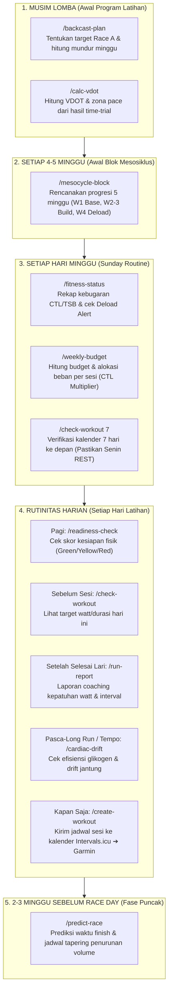

# 📖 Panduan Penggunaan AI Skills & Workflows (Slash Commands Guide)
_Intervals.icu MCP Server & AI Running Coach_

Dokumen ini memuat panduan komprehensif mengenai **kapan dan bagaimana** menggunakan ke-11 AI Skills (Slash Commands) yang tersedia di dalam ekosistem `intervals-icu-mcp`. Seluruh perintah ini kini beroperasi menggunakan arsitektur **Modern Skills** yang mendukung eksekusi via *slash command* di chat serta *semantic autonomous discovery* oleh AI Assistant.

---

## 🗺️ Peta Alur Waktu: "Kapan Saya Harus Mengetik Perintah Ini?"



---

## 📋 Direktori 11 Slash Commands & Waktu Penggunaannya

| No | Slash Command | Berkas Skill | Timeline Penggunaan | Tujuan Utama | Kebutuhan Input Pengguna |
|:--:|---|---|---|---|---|
| **1** | **`/readiness-check`** | [`SKILL.md`](../.agents/skills/readiness-check/SKILL.md) | **Setiap Pagi Hari** (04:30–05:30 WIB) | Evaluasi kesiapan fisik (Green/Yellow/Red) sebelum latihan. | Tidak ada (otomatis baca TSB, ACWR, Sleep, RHR). |
| **2** | **`/check-workout`** | [`SKILL.md`](../.agents/skills/check-workout/SKILL.md) | **Sebelum Mulai Sesi Lari** | Melihat detail target intensitas, durasi, dan watt/pace sesi hari ini. | Opsional: rentang hari (contoh: `/check-workout 7`). |
| **3** | **`/run-report`** | [`SKILL.md`](../.agents/skills/run-report/SKILL.md) | **15–30 Menit Pasca-Lari** | Evaluasi eksekusi lari (kepatuhan watt, HR, kadens, dan interval). | Tanggal sesi, nama sesi, skor RPE (1-10), catatan fisik. |
| **4** | **`/cardiac-drift`** | [`SKILL.md`](../.agents/skills/cardiac-drift/SKILL.md) | **Pasca-Long Run / Tempo Selesai** | Memeriksa penurunan efisiensi jantung (*Aerobic Decoupling* $H_1$ vs $H_2$). | Opsional: Activity ID (default: lari terakhir). |
| **5** | **`/fitness-status`** | [`SKILL.md`](../.agents/skills/fitness-status/SKILL.md) | **Setiap Hari Minggu Malam** | Evaluasi CTL (Fitness), ATL (Fatigue), TSB (Form), & cek *Deload Alert*. | Opsional: tanggal target (default: hari ini). |
| **6** | **`/weekly-budget`** | [`SKILL.md`](../.agents/skills/weekly-budget/SKILL.md) | **Setiap Hari Minggu Malam** | Menghitung budget beban (TSS/Km) dan alokasi sesi via CTL Multiplier. | Opsional: mode `distance` atau target kenaikan. |
| **7** | **`/create-workout`** | [`SKILL.md`](../.agents/skills/create-workout/SKILL.md) | **Kapan Saja Dibutuhkan** | Menerbitkan planned workout terstruktur ke kalender Intervals.icu. | Tanggal, nama sesi, deskripsi format Teks DSL. |
| **8** | **`/mesocycle-block`** | [`SKILL.md`](../.agents/skills/mesocycle-block/SKILL.md) | **Awal Siklus Baru (4–5 Minggu Sekali)** | Rencana alokasi beban 5 minggu (W1 Base, W2-3 Build, W4 Deload). | Opsional: baseline volume/jarak. |
| **9** | **`/backcast-plan`** | [`SKILL.md`](../.agents/skills/backcast-plan/SKILL.md) | **Awal Musim Lomba (Sekali per Program)** | Menghitung mundur minggu latihan dari tanggal Race Day A. | Tanggal race A dan kategori jarak (misal `half_marathon`). |
| **10**| **`/calc-vdot`** | [`SKILL.md`](../.agents/skills/calc-vdot/SKILL.md) | **Setelah Tes Lari / Time-Trial** | Menghitung skor VDOT offline & 5 zona pace latihan (E, M, T, I, R). | Jarak tempuh tes (km) dan waktu tempuh (MM:SS). |
| **11**| **`/predict-race`** | [`SKILL.md`](../.agents/skills/predict-race/SKILL.md) | **2–3 Minggu Menjelang Race Day** | Prediksi waktu finish lomba & jadwal pemotongan volume tapering. | Jarak race, VDOT, tanggal race, durasi minggu taper. |

---

## 🔍 Panduan Detail Situasi Penggunaan

### 1️⃣ Situasi: Perencanaan Awal Musim Lomba
Digunakan saat Anda baru mendaftar lomba atau menentukan target waktu finish baru:
- **`/backcast-plan <tanggal-race> <jarak>`**:
  - *Contoh*: `/backcast-plan 2026-10-04 half_marathon`
  - *Fungsi*: Menentukan tanggal mulai latihan resmi, membagi 3 fase periodisasi (Base, LT Development, Race Specific), dan menjadwalkan kapan waktu ideal untuk mengikuti race uji coba (Race B / Tune-up).
- **`/calc-vdot <jarak-km> <waktu>`**:
  - *Contoh*: `/calc-vdot 10 47:30` atau `/calc-vdot 5 22:45`
  - *Fungsi*: Menentukan acuan VDOT objektif dan memetakan rentang pace latihan harian.

---

### 2️⃣ Situasi: Awal Blok Latihan Baru (Setiap 4–5 Minggu)
Digunakan setelah Anda menyelesaikan minggu pemulihan (*deload*) dan siap memulai siklus beban baru:
- **`/mesocycle-block`**:
  - *Contoh*: `/mesocycle-block` (atau `/mesocycle-block 65` jika baseline 65 km/minggu)
  - *Fungsi*: Menyusun rencana 5 minggu terstruktur:
    - **W1**: Baseline (0%)
    - **W2**: Build (+3% s.d. +5%)
    - **W3**: Peak Build (+3% s.d. +5%)
    - **W4**: **Planned Deload (-10% dari Baseline W1)**
    - **W5**: New Baseline (sedikit di atas W1)

---

### 3️⃣ Situasi: Evaluasi Mingguan (Setiap Hari Minggu Malam)
Digunakan untuk menutup evaluasi minggu berjalan dan menyiapkan target minggu berikutnya:
1. **`/fitness-status`**:
   - Melihat tren CTL, ATL, TSB, dan Ramp Rate aktual mingguan.
   - Sistem secara otomatis mendeteksi apakah minggu depan wajib mengaktifkan **Deload Week Protocol**.
2. **`/weekly-budget`**:
   - Menghitung total beban yang aman dan membaginya ke dalam **CTL Multiplier**:
     - *Easy / Recovery*: `0.70× – 0.90× CTL` (cap $\le$ 60 menit).
     - *Subthreshold / Quality*: `1.25× – 1.75× CTL`.
     - *Long Run HM*: `1.50× – 2.00× CTL`.
   - Mengaktifkan **Single Run Safeguard** untuk memastikan Long Run tidak melebihi 105% dari *30-Day Max TSS*.
3. **`/check-workout 7`**:
   - Memastikan kalender 7 hari ke depan sudah terisi dan hari Senin terjadwal **REST TOTAL**.

---

### 4️⃣ Situasi: Rutinitas Harian Lari (Daily Cycle)
Alur yang dijalankan dari hari ke hari:

#### 🌅 A. Pagi Hari (Bangun Tidur / Sebelum Sesi)
- **`/readiness-check`**:
  - Dijalankan saat bangun tidur (04:30 – 05:00 WIB).
  - Mengevaluasi apakah tubuh siap menerima beban keras (GREEN) atau harus dibatasi ke Z1 Easy / Deload (YELLOW/RED).
- **`/check-workout`**:
  - Membaca target sesi hari ini: durasi menit, rentang target watt (% CP), dan batas atas denyut jantung (*HR ceiling*).

#### 🏁 B. Pasca-Lari (Setelah Data Terunggah ke Intervals.icu)
- **`/run-report`**:
  - Dijalankan 15–30 menit setelah lari selesai.
  - Masukkan detail sesi:
    ```text
    /run-report
    - Hari/Tanggal: Rabu, 2 September 2026
    - Sesi Eksekusi: Subthreshold II (55 menit)
    - RPE: 7/10
    - Catatan Fisik: Interval 1-3 lancar, hidrasi cukup, pernapasan stabil.
    ```
- **`/cardiac-drift`**:
  - Dijalankan khusus setelah sesi lari panjang (> 60 menit) atau sesi tempo.
  - Mengecek apakah cardiac drift $< 3.0\%$ (sangat prima) atau $> 5.0\%$ (tanda kelelahan/dehidrasi).

#### 🗓️ C. Kapan Saja
- **`/create-workout`**:
  - Menjadwalkan sesi lari terstruktur menggunakan Teks DSL yang otomatis tersinkronisasi ke smartwatch (Garmin / Coros).

---

### 5️⃣ Situasi: Menjelang Hari Perlombaan (2–3 Minggu Sebelum Race Day)
Digunakan saat fase puncak persiapan lomba:
- **`/predict-race`**:
  - *Contoh*: Masukkan target race (misal Half Marathon 21.1 km) dan tanggal race.
  - *Fungsi*: 
    - Menghitung prediksi waktu finish realistis dari VDOT yang dikoreksi kebugaran kronis (CTL) dan kesegaran akut (TSB).
    - Menghasilkan jadwal tapering 2 minggu (Minggu -2: volume 75%, Minggu Race: volume 50%).
    - Menyusun strategi pacing *even-split* per kilometer.

---

## ⚡ Quick Cheat Sheet (Hafalan Cepat)

```text
🌅 Pagi Hari (Bangun Tidur)   ➔  /readiness-check
👟 Sebelum Berangkat Lari     ➔  /check-workout
🏁 Setelah Selesai Lari        ➔  /run-report
📈 Pasca-Long Run / Tempo      ➔  /cardiac-drift
📅 Minggu Sore / Malam         ➔  /fitness-status  lalu  /weekly-budget
🗓️ Menjadwalkan Sesi Baru      ➔  /create-workout
🏆 2-3 Minggu Dekat Lomba      ➔  /predict-race
```
